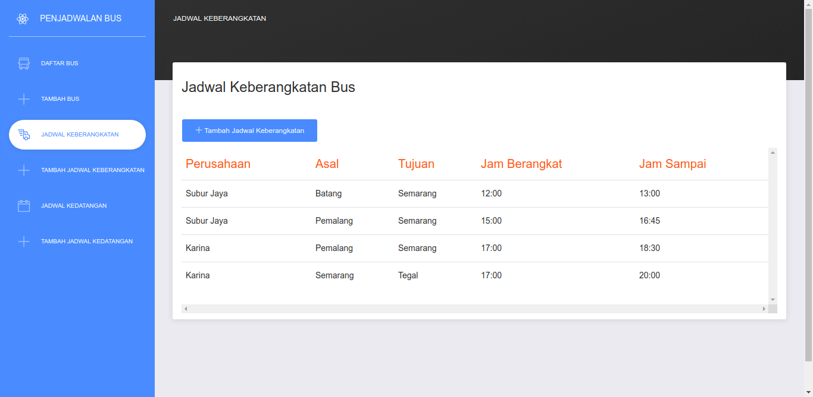

# Bus Schedule
Bus Schedule is an Information System Application built with React.



---
## Table of Contents
* [Preparation](#preparation)
* [Installation](#installation)
* [Deployment](#deployment)
* [Additional Notes](#notes)
* [Contributing](#contributing)
---

## Preparation
* Make sure you have Node and NPM on your local machine
* Choose one of the server-side application below and **install** it
   * [Bus REST PHP](https://github.com/fannyhasbi/bus-schedule-rest)
   * [Bus REST Golang](https://github.com/fannyhasbi/bus-schedule-rest-go)

## Installation
1. Clone or Download this repository
   ```bash
   git clone https://github.com/fannyhasbi/bus-schedule-react
   ```
2. `npm install`
3. `npm start`

## Deployment
I use [Firebase](https://firebase.google.com) to deploy this project. So, if you wanna deploy it to another source feel free to follow these guide lines and read your hosting documentation to deploy.

1. `npm run build`
   
   It will create a folder called `build` which contains minified and production-ready js files

2. Log in to your firebase
   
   `firebase login`

3. Initiate and choose a hosting
   
   `firebase init`

4. If you are requested to choose deployment directory, just type `build` (not `public` directory).

5. Deploy it using `firebase deploy` and it's all done.

If you want to deploy it again, just simply type
```bash
npm run deploy:firebase
```

## Notes
All constant values are store in `/src/config/constant.js`

* If you want to change the *url*s just change it into your own project *url*
* If you want to change between stages just change the `APP_STATUS` value into `development` or `production`

## Contributing
1. Fork this repo
2. Make a new branch (`git checkout -b your-feature`)
3. Add your codes and/or documentations
4. Make commit(s)
5. Push your changes (`git push origin -am "My awesome features"`)
4. Create new **Pull Request** to this repo

<h2>Happy Coding!</h2>